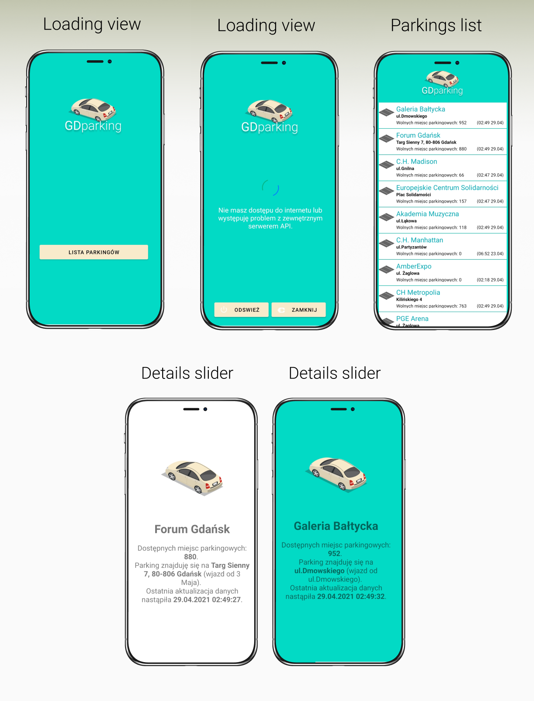

# android-app-gdparking

#### Available parkings list with details in Gdańsk App

> Android application which displaying the list of parking lots with number of available spaces in Gdańsk. The data is fetching from API.

APIs: 
- https://ckan2.multimediagdansk.pl/parkingLots
- https://ckan.multimediagdansk.pl/dataset/cb1e2708-aec1-4b21-9c8c-db2626ae31a6/resource/d361dff3-202b-402d-92a5-445d8ba6fd7f/download/parking-lots.json 

## 🔎 Demo
Application instalation file is in the repositorium: GDparking.apk.

## 🕹️ Technologies
- Java 
- Project/Application was written in Android Studio. Project is in the folder: app. 
